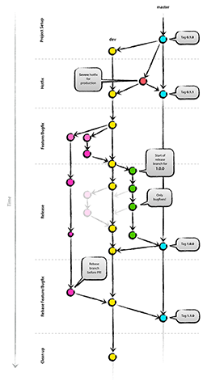

**This is a work in progress.**



The goal of this repository is to have a shareable reference point for working with git, specifically using the gitflow branching model. Everything in this guide is heavily inspired and based on [nvie's original blog post](http://nvie.com/posts/a-successful-git-branching-model/). As he correctly realised, the easiest way to teaching git is using a "big picture" figure:

[Gitflow Life Cycle PDF Version](gitflow.pdf)

Is this guide for you? Gitflow works well in mid-sized teams with multple deployment environments. There are reasons for not using any dev branch at all (in flat organisations), but it requires continuous live deployment, which is not always possible (when working for a customer, rather than on a product).

## Information
This section is only important if you're evaluating this to share with your colleagues. If you were sent here, [jump right to `Getting started`](#1-getting-started).

## 0. Table of contents
1. [Getting Started](#1-getting-started)
    * Git basics
    * Checklist
2. [Gitflow](#2-gitflow)
    * Branch types
    * Pull Requests
    * Forking
    * Flow charts
3. [Cookbook](#3-cookbook)
    * Project setup
    * Hotfix
    * Feature/Bugfix
    * Release
    * Rebase
    * Advanced rebasing
    * Clean up
4. [Helpers](#4-helpers)
    * CLI alias
5. [Recommended tools](#5-recommended-tools)

## 1. Getting started
To really grasp the concepts behind git, it is critical to know the basic commands. That’s why this guide will be using the command line. If you want to streamline the process with a GUI later on (see recommended Tools) that’s fine, however command line is and should be the default.

Please take your time to go through each chapter in this guide and **ask your peers** in case something is unclear!

### Git basics
Because there’s already comprehensive documentation on Git basics available on the web and this guide focuses more on the workflow, I won’t cover them here. Instead, I provide links to resources I found best for starting with git. Please go through the following guides:

* [git - the simple guide](http://rogerdudler.github.io/git-guide/)
* [Got 15 minutes and want to learn Git?](https://try.github.io)

Now you should have a basic understanding on how to use git.

### Checklist
Make sure you understand the following commands and concepts before continuing:

* Git init/clone
* Git status
* Git Add
* Git reset
* Git commit 
* Git push
* Git pull
* Git branch 
* Git checkout 
* Git merge 
* Staging Area

Let's quickly check if you have set your name and email address:

```sh
git config -l
```

If you don't see your name and email address, you should set them now:

```sh
git config --global user.name "John Doe"
git config --global user.email "john.doe@acme.git"
```

## 2. Gitflow
One of the major strengths of Git is its flexibility, which is why there are many different established workflows out in the wild. In this guide, we're discussing the standard workflow for working with open source software (on Github), called Gitflow. It’s a branching model designed around project deployment.

### Branch Types
There are two permanent branches:

* **Master**. This is the first branch of every Git repository and should always represent the current state on the live server (production). 
* **Dev**. Originating from the master branch, this is the place where development happens. Consequently this branch should represent the current state on the development/staging server.

Everyone will communicate with the main branches through pull requests only. **No direct pushes to main branches should ever happen.**

#### Supporting branch types
While `master` and `dev` are permanent branches, Gitflow also introduces supporting temporary branches:

| Type | Description | Naming |
| ------------- |-------------| -----|
| Hotfix | If you encounter a severe bug in the production environment that prevents proper functioning, the hotfix branch is the way to go. It is the only temporary branch originating from master and should only contain small fixes. Merge this branch in both dev and master after completion. | hotfix/<name> |
| Feature | This is the most common branch type you will be using. Originating from dev, this branch contains one logically definite feature and will be merged back into dev. | feature/<name> |
| Bugfix | Exactly the same as the Feature type. This is just a distinction for better readability later in the history of the repository. | bugfix/<name> |
| Release | When you’re ready to deploy a new release from dev to master it may be a good idea to use a release branch. If you’re working alone, this branch isn’t necessary. However if other team members will continue working on the dev branch, it makes sense to freeze a current state for release and do any bug fixes on this branch. Merge this branch both into dev and master. | release/<name> |

All development happens on these branches. The shorter the lifespan of said branches, the easier it will be to merge them later with your pull requests. After a successful merge, the branch is normally deleted (thus temporary).

### Pull Requests
When we’re talking about merging one branch into another, a pull request is always involved. In later graphics, an arrow from one branch to another represents a pull request. In other words, this is our tool for getting code from one branch to another. After a successful pull request, the temporary branch is normally deleted.

Pull requests are a feature of Git itself, however the “vanilla” way of creating a pull request would be copying a diff of your branch to the one you want to merge into, and then sending this diff via Email to the repository maintainer. Fortunately, services like Github simplify this process significantly by providing a GUI.

// todo: how to actually make a pull request.

### Forking
A fork is a copy of a repository. Forking a repository allows you to freely experiment with changes without affecting the original project. This is widely used in open source: The code base is publicly available on for example Github, but you won’t be able to directly push changes into the repository, as you’re not the maintainer and therefor don’t have the privileges to do so. The maintainer has the responsibility to decide, which changes will flow into his repository and which won’t. In other words, he accepts or declines pull requests.

Now, to create your own pull request, you will need your own repository -> your own fork.

So additionally to the main project repository, every involved employee will have his own fork of the repository. Make sure that your peers have read access to your fork.

// todo: how to create your own fork.

### Flow charts
This chapter was intentionally held short, because the past made clear that it’s easiest to explain Git using flowcharts. The next chapter contains a cheat sheet, picturing the life cycle of a project repository in a flowchart.

In the subpages you’ll find the single steps explained in depth. It's a good idea to try the commands on a real repository when going through the chapters.

## 3. Cookbook
### Project setup
### Hotfix
The important points to remember are:
* Hotfixes are small fixes for severe bugs in production
* This is the only type of supporting branch, which should originate from master
* Merge hotfix branches both into dev and master, as you don't want to lose your fix with the next release of dev
* Create a new tag with a minor version bump ("v1.0.0" -> "v1.0.1") after merging the release

```sh
git checkout master
git pull

# create the new hotfix branch
git checkout -b hotfix/<name>

# make your changes
git add <file>
git commit -m "<message>"
...

# push the changes to your fork
git push -u origin hotfix/<name>

# create a pull request
# PR origin/hotfix/<name> -> upstream/dev

# create a new tag
git checkout master
git pull
git tag -a v1.0.1
git push upstream --tags
```

### Feature/Bugfix
The important points to remember are:
* These are the most common branch types
* The only difference between feature and bugfix is the wording. It is easier to read the git history if you're differentiating between new features and bugfixes.
* Always create new bugfix/feature branches from dev

```sh
git checkout dev
git pull

# create the new branch
git checkout -b feature/<name>

# make your changes
git add <file>
git commit -m "<message>"
...

# push the changes to your fork
git push -u origin feature/<name>

#
# It's good practice to rebase your feature or bugfix branch before
# creating pull requests. See chapter "Rebase".
#

# go to stash and create the pull request from your fork
# PR origin/feature/<name> -> upstream/dev
```

### Release
The important points to remember are:
* Release branches are only necessary with multiple team members
* The release branch is created from dev and usually means feature freeze for the imminent version to be released
* Other team members may continue working on the dev branch, however there should only be bugfixes on the release branch from this point on
* These bugfixes may be continuously merged back to dev, if necessary
* Merge the branch to both dev and master
* Create a new tag after merging the release

```sh
git checkout dev
git pull

# create the new branch with the version number (e.g. "v1.0.0") and directly push it 
git checkout -b release/<version>
git push -u origin release/<version>

#
# at this point, the release branch should be deployed to a staging environment and thoroughly tested!
#

# if necessary, make your bug fixes 
git add <file>
git commit -m "<message>"
... 
git push

# go to stash and create the pull requests
# PR upstream/release/<version> -> upstream/master
# PR upstream/master -> upstream/dev
```

### Rebase
Before merging your feature- or bugfix branch back into `upstream/dev`, you should rebase your branch. Other team members may have already merged their work back into `dev` and we want to avoid merge conflicts. The basic idea of rebasing is to:

1. update the base branch to the latest state
2. reapply your commits one by another on top
3. merge conflicts on a single commit base in the process

Following graphic illustrates this process. Orange commits may be new features from your teammates. After the rebase, your feature branch will appear as it was created after the orange commits.

Now that your branch originates from the latest commit, your branch is ready for the pull request.

### Advanced rebasing
### Clean up
Yes, clean up. This makes it not only easier for you, but also for your colleagues who may be reviewing your code or have to check something in your repository. This includes:

* Delete old branches
* Clean up local branch references

```sh
# delete a local branch
git branch -D feature/delete

# delete a remote branch
git push origin :feature/delete

# clean up local branch references git branch -a
git branch remote prune origin git branch -a
```

See [CLI Aliases](#cli-alias) for shortening these steps.

## 4. Helpers
### CLI alias

## 5. Recommended tools

## Todo
* [ ] Improve .png version
* [ ] Write proper todo list